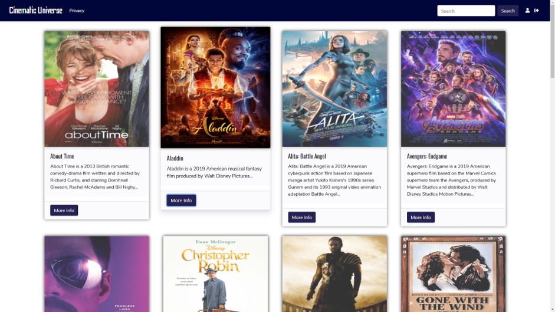
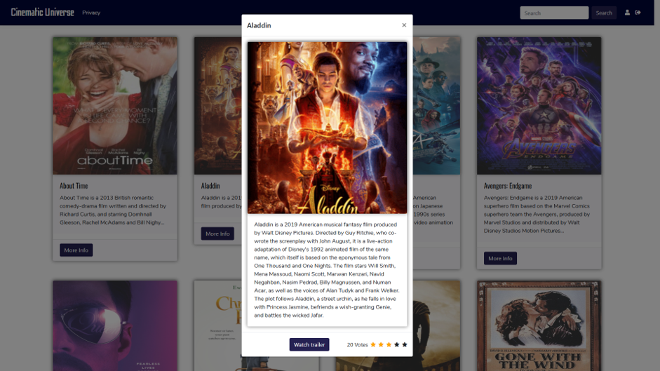

# Movie-Rating-Website
A movie rating website using ASP.NET Blazor server and Razor pages.

Used Bootstrap4 for the 4-column layout, used font-awesome and google fonts for additional stylings.

Used a JSON file as mock database, where movie ratings were stored and new ratings were added as soon as user set a rating.

The movie single page, click the stars to rate.

Created a JsonFileMovieService to read data and return all movies from the JSON file.

Used LINQ query to select specific movies and update their ratings.

Created a controller API for getting the movie list and updating ratings.

